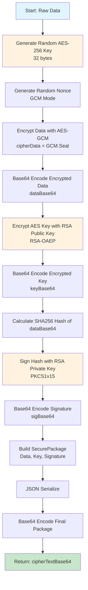
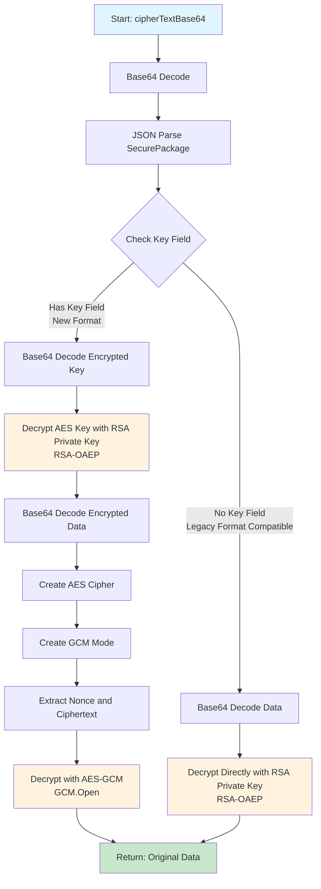
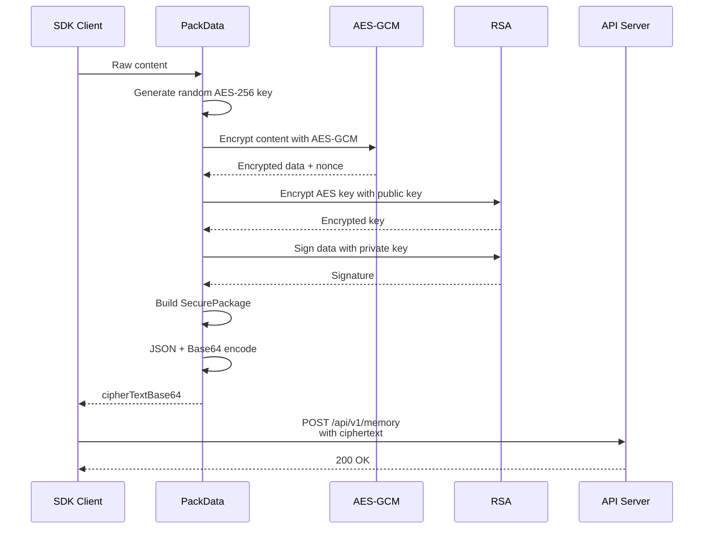
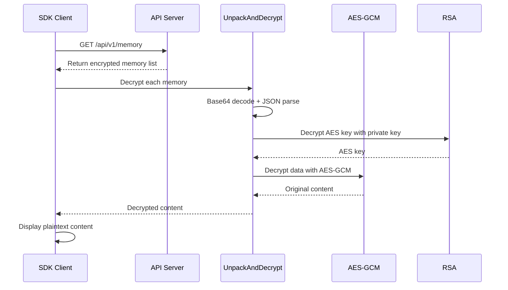
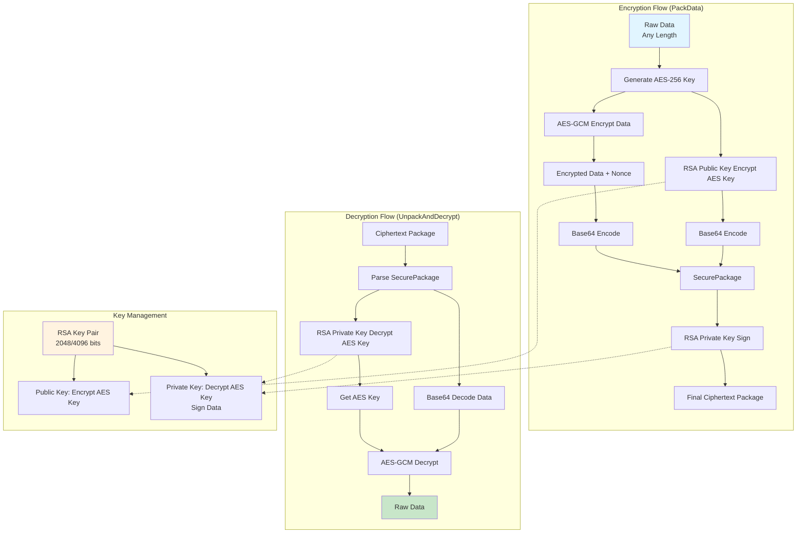

import { Aside } from '@astrojs/starlight/components';

The Memo SDK uses a hybrid encryption architecture combining symmetric and asymmetric encryption to provide secure, end-to-end encrypted storage for your memories. This page explains the technical details of how data is encrypted, stored, and decrypted.

## Overview

The SDK uses a **hybrid encryption approach**:
- **AES-256-GCM** (symmetric encryption) for encrypting data of any size
- **RSA** (asymmetric encryption) for encrypting the AES key
- **RSA signatures** for data integrity verification

<Aside type="tip">
This hybrid approach combines the speed of symmetric encryption with the security benefits of asymmetric encryption, allowing efficient encryption of large amounts of data while maintaining strong security.
</Aside>

## 1. PackData Flow (Encryption)

When you save a memory, the SDK encrypts your content using the following process:

### Step-by-Step Process

1. **Generate AES Key**: A random 256-bit (32-byte) AES key is generated for each encryption operation
2. **Generate Nonce**: A random nonce is created for GCM mode (ensures uniqueness)
3. **AES-GCM Encryption**: The raw data is encrypted using AES-256 in GCM mode
4. **Base64 Encoding**: The encrypted data is Base64 encoded
5. **RSA Encryption**: The AES key is encrypted using the RSA public key with OAEP padding
6. **Digital Signature**: A SHA256 hash of the encrypted data is computed and signed with the RSA private key
7. **Package Creation**: All components are assembled into a `SecurePackage` structure
8. **Final Encoding**: The package is JSON serialized and Base64 encoded

## 2. UnpackAndDecrypt Flow (Decryption)

When retrieving memories, the SDK decrypts the encrypted content:

### Decryption Process

1. **Decode Package**: Base64 decode and JSON parse the `SecurePackage`
2. **Key Decryption**: Use RSA private key to decrypt the AES key (RSA-OAEP)
3. **Data Decryption**: Use the decrypted AES key to decrypt the data with AES-GCM
4. **Integrity Verification**: GCM mode automatically verifies data integrity during decryption
5. **Legacy Support**: The SDK supports both new format (with separate key) and legacy format (direct RSA encryption)

## 3. SaveMemory Complete Flow

Here's the complete sequence when saving a memory:

<Aside type="note">
The server never sees your plaintext data. Only the encrypted ciphertext is transmitted and stored.
</Aside>

## 4. GetMemories Complete Flow

When retrieving memories from the server:

## 5. Hybrid Encryption Architecture

The complete architecture diagram:

## GCM Mode

The Memo SDK uses **AES-256-GCM** (Galois/Counter Mode) for encrypting your memories. GCM is an authenticated encryption mode that provides both encryption and data integrity verification in a single operation.

<Aside type="tip">
For a detailed explanation of GCM mode, including how it works, why we chose it, and implementation details, see the [GCM Mode Reference](/reference/gcm/).
</Aside>

## Encryption Types

The Memo SDK uses **hybrid encryption** combining symmetric and asymmetric encryption. For detailed explanations, see:

- [Symmetric vs Asymmetric Encryption](/reference/symmetric-asymmetric-encryption/) - Learn about the two types of encryption and why we use both
- [RSA OAEP Padding](/reference/rsa-oaep/) - Understand the padding scheme used for RSA encryption

## Key Points Summary

1. **Hybrid Encryption**: Uses AES-256-GCM (symmetric) to encrypt data of any size, RSA (asymmetric) to encrypt the AES key
2. **Symmetric Encryption (AES)**: Same key for encryption and decryption, fast, suitable for large data
3. **Asymmetric Encryption (RSA)**: Public key encrypts, private key decrypts, solves key transmission problem, but slow
4. **OAEP Padding**: Uses optimal asymmetric encryption padding scheme, more secure than PKCS#1 v1.5
5. **Authenticated Encryption**: GCM mode provides data integrity and authentication, no additional HMAC needed
6. **Digital Signatures**: Uses RSA private key to sign encrypted data, ensures data hasn't been tampered
7. **Backward Compatibility**: Supports decryption of legacy format (direct RSA encryption)
8. **Security**: Each encryption uses random AES key and Nonce, ensuring same content produces different ciphertext
