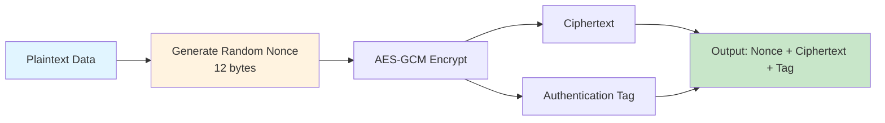

import { Aside } from "@astrojs/starlight/components";

**GCM (Galois/Counter Mode)** is the authenticated encryption mode used by the Memo SDK to encrypt your memories. It provides both encryption and authentication in a single operation, ensuring your data is both confidential and tamper-proof.

## What is GCM Mode?

GCM is an AES encryption mode that provides both:

- **Encryption**: Encrypts the data to ensure confidentiality
- **Authentication**: Ensures data integrity (verifies data hasn't been tampered with)

<Aside type="tip">
  GCM is an **AEAD (Authenticated Encryption with Associated Data)** mode,
  meaning it combines encryption and authentication in one efficient operation.
</Aside>

## Understanding GCM Components

### Galois Field

**Galois** refers to **Galois Field** (also called Finite Field), a mathematical concept:

- Named after French mathematician Évariste Galois
- GCM uses Galois field multiplication to compute authentication tags
- Highly efficient in hardware implementations

**In simple terms**: Galois is a special mathematical operation method that allows GCM to quickly and securely compute data integrity tags.

### Counter Mode

**Counter Mode**:

- Uses a counter to generate a keystream
- Each data block uses a different counter value
- Supports parallel encryption for better performance

**GCM = Galois (authentication) + Counter (encryption)**

## Seal and Open Operations

GCM uses two main operations: **Seal** (encrypt) and **Open** (decrypt).

### Seal Operation

**Seal** operation:

- **Encrypts** the plaintext to ciphertext
- **Authenticates** by computing and appending an authentication tag
- **Packages** the Nonce, ciphertext, and tag together

```go
cipherData := gcm.Seal(nonce, nonce, rawData, nil)
//           ↑
//          "Seal" the data: encrypt + add authentication tag
```

### Open Operation

**Open** operation:

- **Decrypts** the ciphertext to plaintext
- **Verifies** data integrity automatically
- **Fails** if the data has been tampered with

```go
plainText, err := gcm.Open(nil, nonce, ciphertext, nil)
//                    ↑
//                   "Open" the sealed data: decrypt + verify integrity
```

**Analogy**:

- **Seal** = Put a file in a safe and attach a tamper-evident seal
- **Open** = Open the safe and check if the seal is intact

If the seal is broken (data tampered), Open will fail and return an error.

## GCM Workflow

Here's how GCM encrypts your data:



## Key Characteristics

### 1. Authenticated Encryption (AEAD)

- Encryption and authentication in a single operation
- Automatic integrity verification during decryption
- Decryption fails if data is tampered

### 2. Performance Benefits

- Supports parallel processing
- Hardware acceleration support (modern CPUs have AES-NI instruction set)
- More efficient than separate encryption + HMAC

### 3. Nonce Requirements

- Each encryption must use a unique Nonce
- Nonce doesn't need to be secret, but must never be reused
- Nonce is typically transmitted with the ciphertext

## Why Choose GCM?

| Feature                  | GCM     | CBC                      | ECB         |
| ------------------------ | ------- | ------------------------ | ----------- |
| Encryption               | ✅      | ✅                       | ✅          |
| Authentication/Integrity | ✅      | ❌                       | ❌          |
| Performance              | ✅ Fast | ⚠️ Medium                | ✅ Fast     |
| Security                 | ✅ High | ⚠️ Needs additional HMAC | ❌ Insecure |
| Parallel Processing      | ✅      | ❌                       | ✅          |

<Aside type="note">
  GCM is the recommended mode for modern applications because it provides both
  encryption and authentication without requiring additional operations.
</Aside>

## Implementation in Memo SDK

Here's how GCM is used in the Memo SDK:

```go
// Encryption
nonce := make([]byte, gcm.NonceSize())  // Generate random Nonce
cipherData := gcm.Seal(nonce, nonce, rawData, nil)
// Result contains: nonce + encrypted data + authentication tag

// Decryption
nonce, ciphertext := cipherData[:nonceSize], cipherData[nonceSize:]
plainText, err := gcm.Open(nil, nonce, ciphertext, nil)
// Automatically verifies integrity, returns error if tampered
```

## Security Advantages

1. **Tamper Prevention**: If ciphertext is modified, decryption automatically detects and fails
2. **Replay Attack Prevention**: Nonce uniqueness ensures same plaintext produces different ciphertext
3. **Efficiency**: Single operation completes encryption and authentication, faster than separate encryption + HMAC

## Related Topics

- Learn about the [complete encryption flow](/guides/how-it-works/) in the Memo SDK
- Understand [hybrid encryption](/guides/how-it-works/#hybrid-encryption-architecture) architecture
- Explore [security features](/features/security/)
