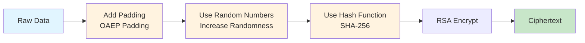

import { Aside } from "@astrojs/starlight/components";

The Memo SDK uses **RSA-OAEP** (Optimal Asymmetric Encryption Padding) for encrypting AES keys. OAEP is a modern, secure padding scheme that enhances the security of RSA encryption.

## What is OAEP?

**OAEP** stands for **Optimal Asymmetric Encryption Padding**:

- **OAEP** = Optimal Asymmetric Encryption Padding
- A padding scheme used with RSA encryption
- More secure than older padding schemes like PKCS#1 v1.5

### Why Padding is Needed

RSA encryption cannot directly encrypt raw data; it needs **padding** first:

1. **Fixed-size blocks**: RSA can only encrypt fixed-size data blocks
2. **Size limitations**: A 2048-bit RSA key can only encrypt 245 bytes (minus padding)
3. **Security enhancement**: Padding increases randomness and prevents certain attacks

### Padding Functions

- ✅ **Increases randomness**: Same plaintext produces different ciphertext
- ✅ **Prevents attacks**: Protects against chosen ciphertext attacks
- ✅ **Ensures correct format**: Makes data the correct size for encryption

## OAEP vs PKCS#1 v1.5

| Feature      | OAEP                    | PKCS#1 v1.5                      |
| ------------ | ----------------------- | -------------------------------- |
| Security     | ✅ More secure          | ⚠️ Older, known vulnerabilities   |
| Randomness   | ✅ Uses random numbers  | ⚠️ Weaker randomness             |
| Standard     | ✅ Modern standard      | ⚠️ Old standard                  |
| Recommended  | ✅ Yes                  | ❌ Not recommended               |

<Aside type="tip">
OAEP is the recommended padding scheme for modern RSA encryption due to its superior security properties.
</Aside>

### Why Choose OAEP?

- ✅ More secure, resists more attacks
- ✅ Uses hash functions (e.g., SHA-256) to increase security
- ✅ Modern encryption standard recommendation

## OAEP Workflow

Here's how OAEP padding works:



## Implementation in Memo SDK

Here's how RSA-OAEP is used in the Memo SDK:

### Encryption

```go
// Encrypt AES key using OAEP
encryptedKey, err := rsa.EncryptOAEP(
    sha256.New(),        // Hash function: SHA-256
    rand.Reader,         // Random number generator
    s.PublicKey,         // RSA public key
    aesKey,              // Data to encrypt (AES key)
    nil,                 // Optional label (not used here)
)
```

### Decryption

```go
// Decryption using corresponding OAEP
aesKey, err := rsa.DecryptOAEP(
    sha256.New(),        // Must use same hash function
    rand.Reader,         // Random number generator
    s.PrivateKey,        // RSA private key
    encryptedKey,        // Ciphertext to decrypt
    nil,                 // Optional label (must match encryption)
)
```

## Key Points

- **Same hash function**: Encryption and decryption must use the **same hash function** (both SHA-256)
- **Randomness**: OAEP ensures encrypting the same data produces different ciphertext (uses random numbers)
- **Security**: OAEP provides better security than older padding schemes

## Related Topics

- Learn about the [complete encryption flow](/guides/how-it-works/) in the Memo SDK
- Understand [hybrid encryption](/reference/symmetric-asymmetric-encryption/) architecture
- Explore [GCM mode](/reference/gcm/) used for data encryption
